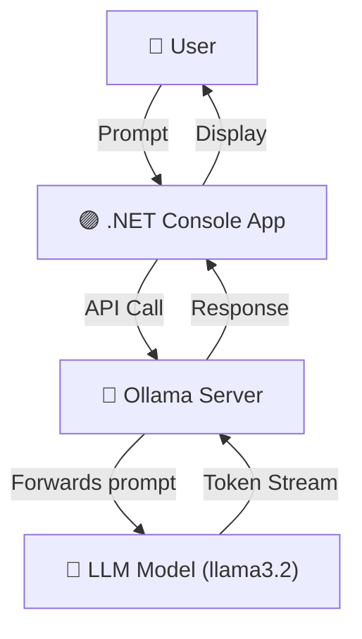

# OllamaSqlExpert

A .NET 9 minimal console chatbot that answers only SQL and database questions—powered by a local LLM running via [Ollama](https://ollama.com/).

**Read the full walkthrough:**  
[Experimenting with Local LLMs in .NET: Building a SQL Expert Chatbot with Ollama](https://medium.com/@sheldonrcohen/experimenting-with-local-llms-in-net-building-a-sql-expert-chatbot-with-ollama-39d66402e97e)

This is part of the [LLMs](../) demo repository.


## How It Works (Architecture)



---

## Features

- Interactive chat experience in your terminal
- Strict "SQL expert" persona (won't answer unrelated questions)
- All data stays local—no cloud or API keys required
- Easily swap models or change the expert persona

---

## Prerequisites

- [.NET 9 SDK](https://dotnet.microsoft.com/download)
- [Ollama installed](https://ollama.com/) (native or Docker)

---

## Getting Started

1. **Start Ollama (with Llama 3):**

   - Native:
     ```bash
     ollama run llama3
     ```
   - Or Docker:
     ```bash
     docker run -d -v ollama_data:/root/.ollama -p 11434:11434 --name ollama ollama/ollama
     ```

2. **Clone the repository and navigate to the project:**

   ```bash
   git clone https://github.com/Shelman2/llms.git
   cd llms/OllamaSqlExpert
   ```

3. **Restore dependencies and run:**

   ```bash
   dotnet restore
   dotnet run
   ```

4. **Start chatting!**

   ```text
   SQL Expert Chatbot (Ollama + .NET)
   Ask a SQL/database question (type 'exit' to quit):

   You: What is a primary key?
   Assistant: A primary key is...
   ```

---

## Configuration

Edit `appsettings.json` to change the model or endpoint (for example, if running Ollama remotely):

```json
{
  "Ollama": {
    "Endpoint": "http://localhost:11434",
    "Model": "llama3.2"
  }
}
```

---

## How Does It Work?

- Uses a "system prompt" to keep the LLM in character as a SQL expert.
- Maintains full chat history for context.
- Powered by [Microsoft.Extensions.AI.Ollama](https://www.nuget.org/packages/Microsoft.Extensions.AI.Ollama) for easy .NET integration.

**Note:**  
No LLM is fully jailbreak-proof, but the system prompt makes it much more likely the assistant stays on topic.


---

## License

[MIT](../LICENSE)
