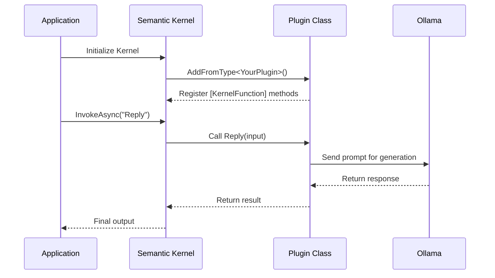

# Semantic Kernel Local Agents

This project demonstrates how to build local AI assistants using [Microsoft Semantic Kernel](https://learn.microsoft.com/en-us/semantic-kernel/) and [Ollama](https://ollama.com/) with no cloud dependencies or API keys required.

**Read the full walkthrough:**  
[Building Local AI Agents with Semantic Kernel and Ollama](https://medium.com/@sheldonrcohen/building-local-ai-agents-with-semantic-kernel-and-ollama-d946c9a18103)

This is part of the [LLMs](../) demo repository.

We’ve implemented three lightweight, modular agents:

- Smart Email Assistant – writes polite and professional replies
- Intelligent Task Manager – generates checklists for goals
- Customer Support Agent – responds to basic support queries

## 🔧 Setup Instructions

1. **Install Ollama**  
   Visit [ollama.com](https://ollama.com) and follow installation instructions for your platform.

2. **Run a model**  
   Start with something efficient like Mistral:
   ```bash
   ollama run mistral
   ```

   You can list available models with:
   ```bash
   ollama list
   ```

   Or try another:
   ```bash
   ollama run llama3
   ```

3. **Configure appsettings.json**
   ```json
   {
     "Ollama": {
       "Model": "mistral",
       "Endpoint": "http://localhost:11434",
       "TimeoutSeconds": 300
     }
   }
   ```

4. **Build and Run**
   ```bash
   dotnet build
   dotnet run
   ```

   Console output will walk you through all three demos.

## 🧠 Plugin Design

Each agent is defined as a Semantic Kernel plugin using simple C# classes with `[KernelFunction]` attributes. For example:

```csharp
[KernelFunction, Description("Crafts a professional and polite reply to an email message")]
public async Task<string> Reply(string input, Kernel kernel)
{
    var prompt = """
You are a helpful, professional email assistant. 
Respond to the message below in a polite and professional tone.

Message:
{input}

Reply:
""";

    var function = kernel.CreateFunctionFromPrompt(prompt);
    var result = await kernel.InvokeAsync(function);

    return result.GetValue<string>() ?? "No response generated.";
}
```

## 📁 Project Structure

```
SemanticKernelAgentDemo
├── Program.cs
├── appsettings.json
├── Models/
│   └── OllamaSettings.cs
├── Services/
│   └── OllamaChatService.cs
├── Plugins/
│   ├── EmailPlugin.cs
│   ├── TaskPlugin.cs
│   └── SupportPlugin.cs
├── Security/
│   └── PromptFilterMiddleware.cs
├── Demos/
│   └── DemoRunner.cs
```

## 🔐 Prompt Injection Protection

We’ve added a basic filter that blocks known exploit phrases (e.g., “ignore previous instructions”). You can extend this with more advanced tools like [Presidio](https://github.com/microsoft/presidio) or content moderation APIs.

## 🧩 How plugins work



## 📚 References

- [Semantic Kernel Plugin Docs](https://learn.microsoft.com/en-us/semantic-kernel/concepts/plugins/?pivots=programming-language-csharp)
- [Ollama Documentation](https://ollama.com/)
- [Microsoft Semantic Kernel](https://learn.microsoft.com/en-us/semantic-kernel/)

Happy building!
