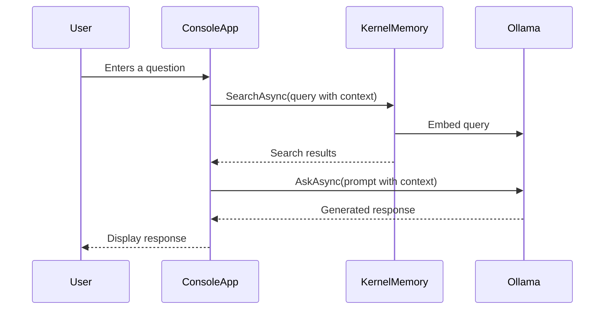

# Simple RAG Ollama

This project provides a streamlined implementation of a Retrieval-Augmented Generation (RAG) system using C# and the [Microsoft Kernel Memory](https://github.com/microsoft/kernel-memory) library integrated with [Ollama](https://ollama.com). It demonstrates how to build a local, efficient, and conversational RAG system using state-of-the-art language and embedding models.

## Features

- Utilizes **Ollama** for text generation (`mistral:latest`) and embeddings (`nomic-embed-text:latest`).
- Efficient document indexing and retrieval powered by Kernel Memory.
- Supports conversational queries with context-aware responses.
- Easily customizable via configuration file (`appsettings.json`).
- Flat namespaces and top-level statements for cleaner, modern C# code structure.

## Getting Started

Follow these steps to set up and run the Simple RAG Ollama application locally.

### Prerequisites

- [.NET 9.0+](https://dotnet.microsoft.com/download)
- [Ollama](https://ollama.com/) server running locally on `http://localhost:11434/`

Ensure the required Ollama models are pulled:

```bash
ollama pull mistral:latest
ollama pull nomic-embed-text:latest
```

### Installation

1. **Clone the repository:**

```bash
git clone https://github.com/Shelman2/llms.git
cd llms/SimpleRAGOllama
```

2. **Install dependencies:**

```bash
dotnet restore
```

### Configuration

Modify the settings in `appsettings.json` as needed:

```json
{
  "Ollama": {
    "Endpoint": "http://localhost:11434/",
    "TextModel": {
      "Name": "mistral:latest",
      "MaxTokenTotal": 125000,
      "Seed": 42,
      "TopK": 7
    },
    "EmbeddingModel": {
      "Name": "nomic-embed-text:latest",
      "MaxTokenTotal": 2048
    }
  },
  "DocumentPaths": [
    "Data/BillGates.txt",
    "Data/SteveJobs.txt",
    "Data/SteveWozniak.txt"
  ],
  "Memory": {
    "ChunkSize": 1024,
    "ChunkOverlap": 200,
    "MaxResults": 5,
    "MinRelevance": 0.3,
    "MaxChatHistory": 10
  }
}
```

Ensure your document files (`BillGates.txt`, `SteveJobs.txt`, `SteveWozniak.txt`) are available under the `Data/` directory.

## Running the Application

Run the application with:

```bash
dotnet run
```

You should see:

```
=== Simple RAG with Ollama ===

Initializing Kernel Memory...
Indexing documents...

RAG system ready! Ask questions about Bill Gates, Steve Jobs, or Steve Wozniak.
Type 'Exit' to quit.

You:
```

## Usage

Interact with the console to ask questions about the indexed documents.  
Type `Exit` to quit the application.

Example interaction:

```
You: When was Steve Jobs born?

Assistant: Steve Jobs was born on February 24, 1955.
```

## Project Structure

```
SimpleRAGOllama
├── Data
│   ├── BillGates.txt
│   ├── SteveJobs.txt
│   └── SteveWozniak.txt
├── Models
│   ├── AppConfig.cs
│   ├── ChatMessage.cs
│   ├── MemorySettings.cs
│   ├── ModelSettings.cs
│   └── OllamaSettings.cs
├── appsettings.json
├── Program.cs
└── SimpleRAGOllama.csproj
```

## Contributions

Contributions and improvements are welcome. Please submit pull requests or open issues via [GitHub](https://github.com/Shelman2/llms).

## License

This project is licensed under the MIT License. See the [LICENSE](LICENSE) file for details.

## Sequence Diagram

